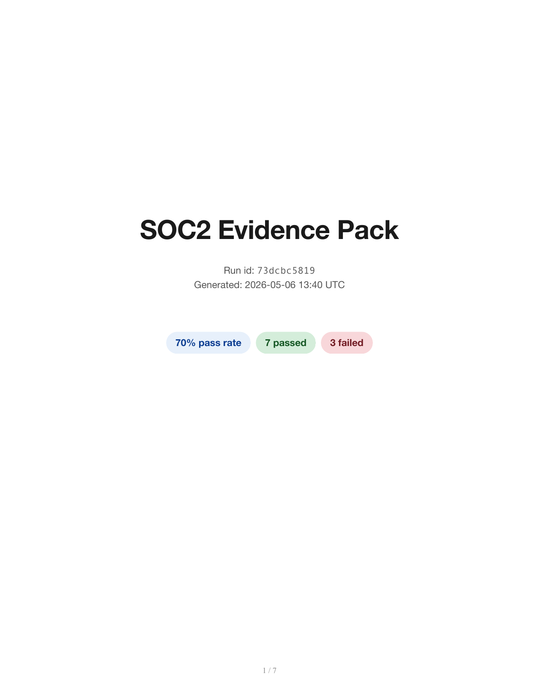
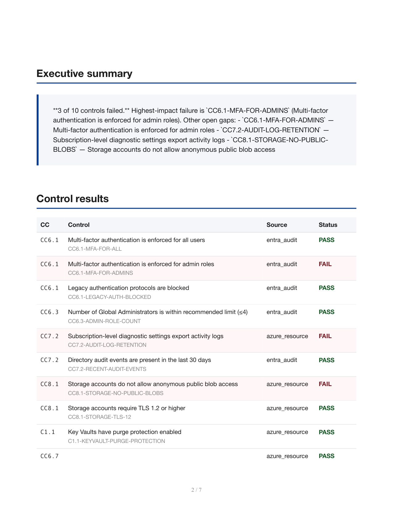
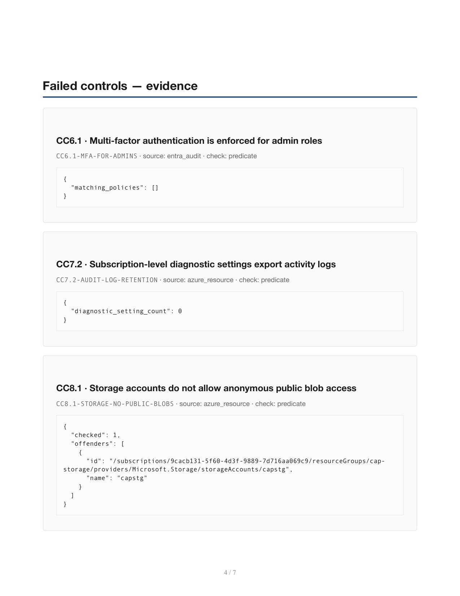

# compliance-evidence-agent

[](https://github.com/anthonyonazure/compliance-evidence-agent/actions/workflows/tests.yml)
[](https://www.python.org/)
[](https://github.com/langchain-ai/langgraph)
[](controls/soc2.yaml)
[](LICENSE)

LangGraph agent that auto-collects SOC 2 evidence from Microsoft 365, Entra ID, and Azure into a signed, hash-stamped PDF audit pack — fast enough to run nightly and detect drift the moment a control regresses.

### Real run against a real Microsoft 365 + Azure tenant

Pulled 207 audit events, 5 conditional access policies, 8 admin role members, and Azure resource configurations from a live M365 tenant. Found 3 real gaps: no MFA-for-admins policy, subscription-level diagnostic settings not exporting activity logs, storage accounts allow anonymous public blob access. SHA-256 of the resulting PDF is written to a sidecar `.sha256` file as a tamper-evidence anchor.

<p>
  
  
  
</p>

## What it does

For each control in [`controls/soc2.yaml`](./controls/soc2.yaml):

1. Pulls evidence from the right source (Entra Conditional Access policies, Entra audit log, admin role memberships, Azure Resource Graph, subscription diagnostic settings)
2. Runs a deterministic Python predicate against the evidence — no LLM in the pass/fail decision (compliance verdicts must be reproducible and auditable)
3. Aggregates per-control PASS/FAIL results
4. Generates a one-paragraph executive summary of failures (LLM, optional — falls back to a deterministic stub when no API key is set)
5. Renders a multi-page PDF: cover with pass-rate pill, exec summary, control table, per-control evidence appendix
6. Computes SHA-256 of the PDF and writes a sidecar `.sha256` file as a tamper-evidence anchor

## Why agents like this win

- **Auditors ask the same evidence questions every quarter.** Automating the collection takes hours-of-AM-time per cycle to seconds.
- **Pure-Python predicates are reviewable and stable.** When the auditor questions a verdict, you point at one function — no hand-waving about LLM behavior.
- **The control map is YAML, not code.** Adding a new control = ~10 lines of YAML + one predicate. ISO 27001 / HIPAA / NIST CSF are siblings, not separate codebases.

## Architecture

```
load_controls (YAML) ──► pull_entra ──┐
                                       ├──► validate (predicates) ──► summarize (LLM) ──► build_pdf (signed) ──► END
                       └─► pull_azure ──┘
```

## Quick start

```bash
# 1. Install (assumes b2b-agent-toolkit is at ../b2b-agent-toolkit)
cd ../b2b-agent-toolkit && pip install -e ".[dev]" && cd -
pip install -e ".[dev]"
cp .env.example .env

# 2. Run with mock data (zero credentials, runs cold)
compliance run

# 3. Run against a real M365 / Azure tenant
#    Add to .env:
#      B2B_USE_MOCKS=false
#      B2B_M365_TENANT_ID=...   (also needs Policy.Read.All, AuditLog.Read.All,
#      B2B_M365_CLIENT_ID=...    RoleManagement.Read.Directory app perms)
#      B2B_M365_CLIENT_SECRET=...
#      B2B_M365_DOMAIN=...
#      B2B_AZURE_SUBSCRIPTION_ID=... (the bot SP needs Reader on the sub)
compliance run -f soc2
```

## What you get

```
evidence-packs/
├── ab12cd3456-evidence-pack.pdf       ← the signed pack
└── ab12cd3456-evidence-pack.sha256    ← tamper-evidence anchor
out/
└── ab12cd3456.json                    ← machine-readable per-control results
```

## Layout

```
controls/soc2.yaml             # control catalog: id, CC, source, check, args
src/compliance/
├── state.py                   # LangGraph TypedDict
├── graph.py                   # state machine wiring
├── nodes.py                   # load → pull (parallel) → validate → summarize → pdf
├── predicates.py              # deterministic SOC 2 predicates (no LLM)
├── validator.py               # dispatches checks against evidence
├── pdf.py                     # Jinja2 + WeasyPrint
└── cli.py                     # `compliance run`
templates/evidence_pack.html   # PDF template (cover, summary, results, evidence)
```
